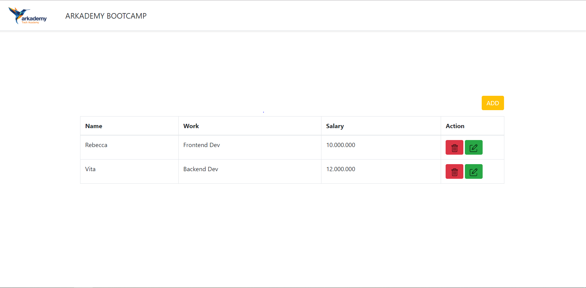
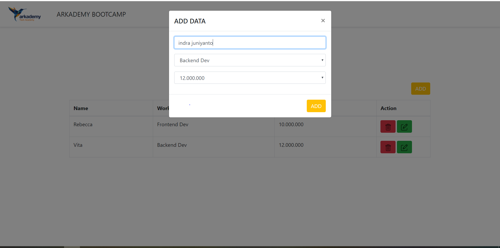
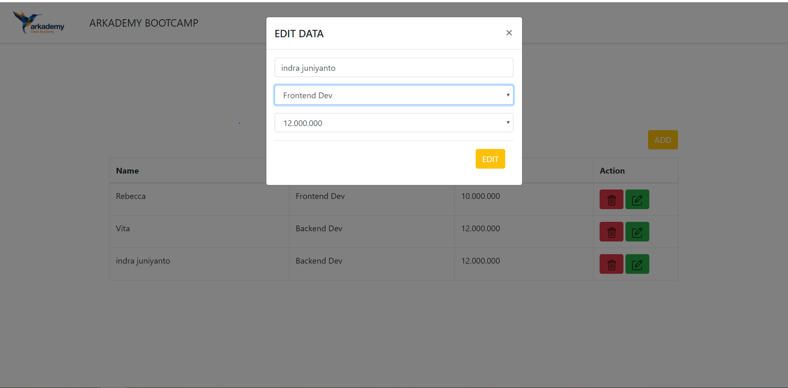

# CATATAN...    
Hallo kak, perkenalkan saya indra juniyanto pada kesempatan ini saya mau menjelaskan tugas yang saya kumpulkan.

pada saat kak download filenya akan tedapat direktori dengan nama direktori masta12, didalam direktori masta12 akan terdapat file-file seperti    
- 1.php
- 2.php
- 3.php
- 4.php
- 5.php   

file tersebut merupakan jawaban no 1-5, oh iya untuk jawaban no 6 saya buatkan lagi direktori dengan nama direktori 6 dan di dalamnya terdapat
- direktori dengan nama A
- direktori dengan nama B&C   

### CARA MENJALAKANNYA

Catatan untuk text editor Online saya saat mengerjakannya menggunakan http://phptester.net/.  

1. untuk no 1 saya menggunakan bahasa program PHP, cara menjalakannya saya menggunakan http://phptester.net/ dengan cara membuka file dengan nama 1.php lalu copy dan paste ke http://phptester.net/ nanti hasil akan muncul apabila codingan sudah di pastekan.

2. untuk no 2 saya menggunakan bahasa program PHP, cara menjalakannya saya menggunakan http://phptester.net/ dengan cara membuka file dengan nama 2.php lalu copy dan paste ke http://phptester.net/ nanti hasil akan muncul apabila codingan sudah di pastekan.

3. untuk no 3 saya menggunakan bahasa program PHP, cara menjalakannya saya menggunakan http://phptester.net/ dengan cara membuka file dengan nama 3.php lalu copy dan paste ke http://phptester.net/ nanti hasil akan muncul apabila codingan sudah di pastekan.

4. untuk no 4 saya menggunakan bahasa program PHP, cara menjalakannya saya menggunakan http://phptester.net/ dengan cara membuka file dengan nama 4.php lalu copy dan paste ke http://phptester.net/ nanti hasil akan muncul apabila codingan sudah di pastekan.

5. untuk no 5 saya menggunakan bahasa program PHP, cara menjalakannya saya menggunakan http://phptester.net/ dengan cara membuka file dengan nama 5.php lalu copy dan paste ke http://phptester.net/ nanti hasil akan muncul apabila codingan sudah di pastekan.

6. untuk no 6 klik direktori dengan nama 6 dan kemudian akan muncul lagi direktori dengan nama A DAN B&C
- apabila kak membuka direktori A akan terdapat file dengan nama createDatabases.txt yang berisikan query seperti yang di minta.  

#### CONTOH GAMBAR NO 6A

   

- dan direktori dengan nama B&C merupakan jawaban dari 6b dan 6c, bahasa program yang saya gunakan PHP dan tampilannya saya menggunakan BOOTSTRAP dengan database MYSQL.  

### CARA MENJALAKAN 
1. copy direktori B&C copy paste ke C:\XAMPP5\htdocs\masta12\6\B&C  (tergantu letak pas kita install sebulmnya).
2. buka browser , browser saat saya kerjakan menggunakan Chrome.
3. ketik http://localhost/phpmyadmin/ di URL.
4. klik new apabila belum ada database.
5. klik import pilih file sql dengan nama db_arkademy.sql
6. apabila sudah import, bisa buka url di Chrome dengan http://localhost/masta12/6/B&C/index.php nanti akan muncul seperti gambar di bawah ini.. 

pada bagian gambar di atas merupakan halaman home apabila klik button ADD akan muncul gambar di bawah ini...  

pada gambar di atas cotoh saya ADD DATA baru.   

apabila klik icon edit yang berwarna hijau akan muncul gambar seperti di bawah ini..

  

pada gambar di atas saya klik icon edit yang datanya indra juniyanto

apabila klik icon delete yang berwarna merah akan muncul gambar seperti di bawah ini..

  

pada gambar di atas saya klik icon delete yang datanya indra juniyanto akan di hapus    

## SELESAI...
Sekian dari penjelasan saya apabila ada salah kata mohon di maafkan :-D :-D
BY : INDRA JUNIYANTO

